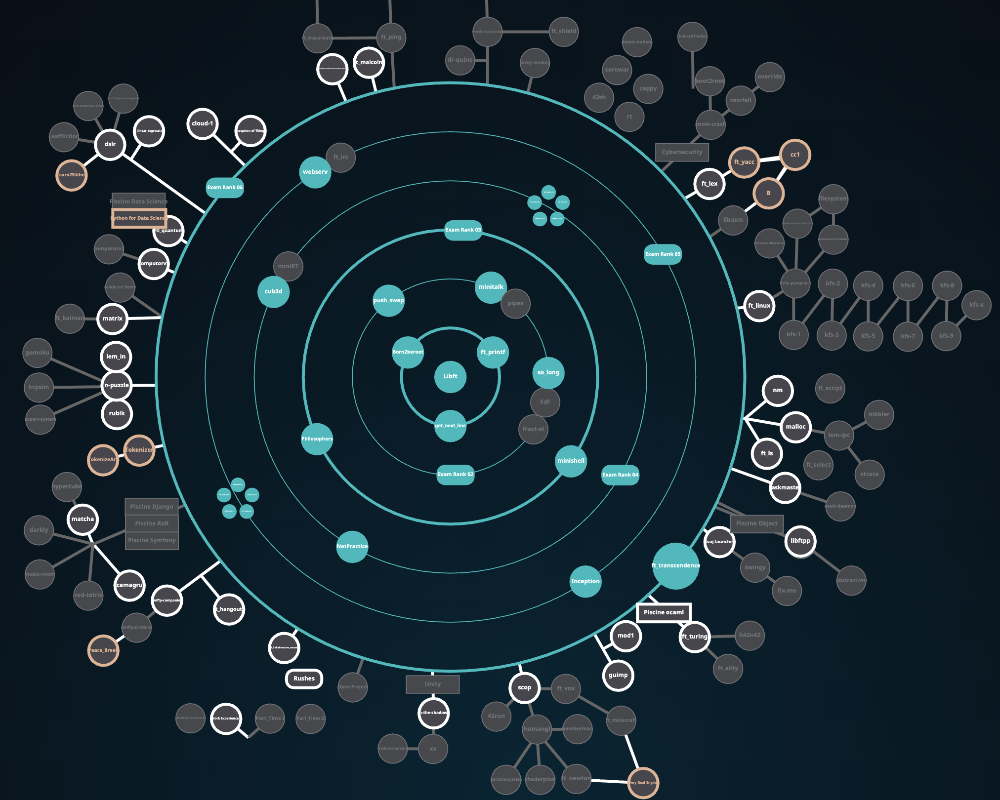

# 🎓 42 Lausanne - Common Core Projects

<div align="center">



**A comprehensive collection of projects completed during the 42 Lausanne Common Core program**

[](https://github.com)
[](https://github.com)

</div>

---

## 📋 Overview

This repository contains all projects completed as part of the **42 Lausanne Common Core** curriculum. The 42 program is a peer-to-peer learning environment focused on software engineering fundamentals, where students learn through hands-on projects without traditional lectures.

The projects progress from basic C programming fundamentals to advanced system programming, web development, and full-stack applications, covering a wide range of computer science concepts.

---

## 🗂️ Projects

### Rank 00 - Foundation

| Project | Type | Description | Technologies | Status |
|---------|------|-------------|--------------|--------|
| **Libft** | Solo | Custom implementation of standard C library functions and data structures (linked lists, memory management) | C | ✅ Done |

### Rank 01 - Basics

| Project | Type | Description | Technologies | Status |
|---------|------|-------------|--------------|--------|
| **get_next_line** | Solo | Read lines from a file descriptor with dynamic memory allocation and buffer management | C | ✅ Done |
| **ft_printf** | Solo | Recreation of the printf function with variadic arguments, format specifiers, and type handling | C | ✅ Done |
| **Born2BeRoot** | Solo | System administration project: Debian server setup, user management, firewall configuration | Bash, VM, Debian | ✅ Done |

### Rank 02 - Algorithms & Graphics

| Project | Type | Description | Technologies | Status |
|---------|------|-------------|--------------|--------|
| **minitalk** | Solo | Inter-process communication using Unix signals (SIGUSR1/SIGUSR2) for message transmission | C, Signals | ✅ Done |
| **so_long** | Solo | 2D game development with MiniLibX: player movement, collectibles, collision detection | C, MiniLibX | ✅ Done |
| **push_swap** | Solo | Sorting algorithm optimization challenge with limited operations (stack manipulation) | C | ✅ Done |

### Rank 03 - System Programming

| Project | Type | Description | Technologies | Status |
|---------|------|-------------|--------------|--------|
| **philosophers** | Solo | Multithreaded solution to the dining philosophers problem with mutexes and deadlock prevention | C, pthreads | ✅ Done |
| **minishell** | Group | Unix shell implementation with command parsing, pipes, redirections, and built-in commands | C | ✅ Done |

### Rank 04 - Advanced C & Networking

| Project | Type | Description | Technologies | Status |
|---------|------|-------------|--------------|--------|
| **netpractice** | Solo | IPv4 networking fundamentals: subnetting, routing, and network configuration | Networking | ✅ Done |
| **cub3D** | Group | 3D raycasting game engine inspired by Wolfenstein 3D with texture mapping | C, MiniLibX | ✅ Done |
| **C++ Modules 00-04** | Solo | Object-oriented programming basics: classes, inheritance, polymorphism, operator overloading, exceptions | C++ | ✅ Done |

### Rank 05 - Web & DevOps

| Project | Type | Description | Technologies | Status |
|---------|------|-------------|--------------|--------|
| **C++ Modules 05-09** | Solo | Advanced C++ concepts: templates, STL containers, file I/O, and design patterns | C++ | ✅ Done |
| **webserv** | Group | HTTP/1.1 web server implementation from scratch (RFC 7230-7235 compliant) with CGI support | C++ | ✅ Done |
| **inception** | Solo | Docker-based infrastructure setup: WordPress, NGINX, MariaDB with Docker Compose | Docker, Linux | ✅ Done |

### Rank 06 - Full-Stack

| Project | Type | Description | Technologies | Status |
|---------|------|-------------|--------------|--------|
| **ft_transcendence** | Group | Full-stack web application with real-time multiplayer Pong game, authentication, chat, and user profiles | TypeScript, NestJS | ✅ Done |

---

## 🛠️ Technologies & Skills

### Languages
- **C** - System programming, algorithms, data structures
- **C++** - Object-oriented programming, templates, STL
- **TypeScript** - Full-stack web development
- **Bash** - Shell scripting and system administration

### Tools & Frameworks
- **MiniLibX** - Graphics library for game development
- **Docker** - Containerization and DevOps
- **NestJS** - Backend framework
- **pthreads** - Multithreading
- **NGINX** - Web server configuration
- **MariaDB** - Database management

### Concepts Covered
- Memory management and optimization
- Data structures and algorithms
- System programming and Unix
- Network programming
- Multithreading and concurrency
- Web development (frontend & backend)
- DevOps and containerization
- Object-oriented design patterns

---

## 📊 Project Statistics

- **Total Projects**: 15
- **Solo Projects**: 12
- **Group Projects**: 3
- **Completion Rate**: 100% ✅

---

## 🎯 Key Achievements

- ✅ Mastered low-level programming in C
- ✅ Implemented complex algorithms and data structures
- ✅ Built full-featured Unix shell
- ✅ Created 2D and 3D game engines
- ✅ Developed RFC-compliant HTTP server
- ✅ Designed and deployed containerized infrastructure
- ✅ Built full-stack web applications

---

## ⚙️ Usage

1. Clone the repository:
   ```bash
   git clone https://github.com/sergiishevchenko/42Lausanne-common-core.git
   cd 42Lausanne-common-core
   ```
2. Navigate to any project folder and follow its README or Makefile instructions to build and run it.
3. Most C projects can be compiled with `make`, while Docker or web projects have setup guides in their directories.

---

## 📝 Notes

All projects were completed according to the 42 Lausanne curriculum requirements and coding standards. Each project includes proper documentation, error handling, and follows the 42 coding norm.

---

<div align="center">

**42 Lausanne Common Core** • 2024

*Peer-to-peer learning • No lectures • Hands-on projects*

</div>